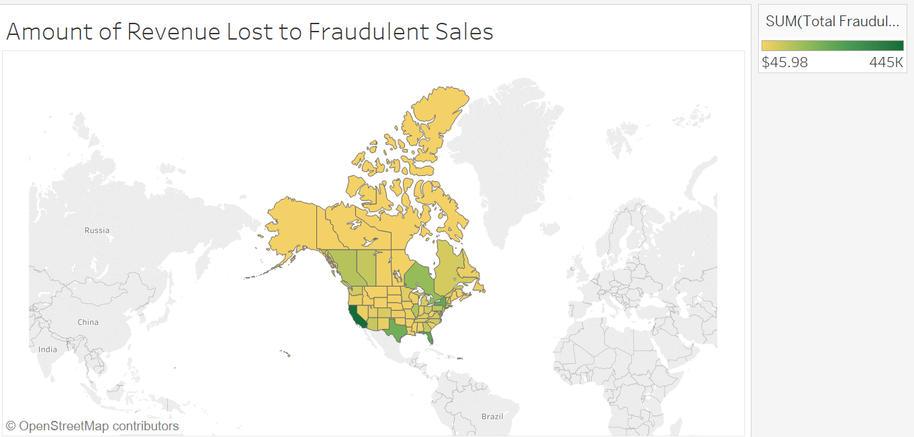
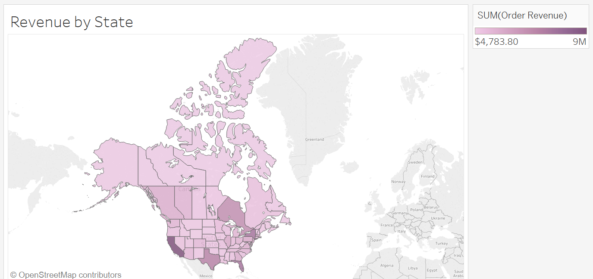

```{r setup, include=FALSE}
knitr::opts_chunk$set(echo = TRUE)
```


We are delighted to have you continue on in our interview process!
Please complete the scenario below. The set of data needed to review is attached separately as an excel
document. Feel free to manipulate the document. You will be presenting your solution and findings
during your onsite interview with the management team.

Operational Scenario:
*See Excel Document Attached

We have 3 locations staffed with manual fraud reviewers: Atlantic City, Montreal, and Ibiza. Fraud
reviewers in this position will evaluate orders for fraudulent activity and decide to cancel or pass the
order. We have 13 total reviewers that we can allocate to any location. Each reviewer can look at 100
orders per hour and work 8 hours total per day.

* Atlantic City is staffed from 8a-6p EST (6 hours ahead)

* Montreal is staffed from 10a-9p EST (6 hours ahead)

* Ibiza is staffed from 2a-10a EST (6 hours ahead)

Using the data in the attached spreadsheet please analyze and recommend your staffing
recommendations for all 3 locations assuming that this data will remain constant year round. The
spreadsheet contains one month of order data with order times and dates. In addition to a staffing
recommendation please highlight any other trends that you see in our fraud data. Would you have any
further questions on the ask? What would your next steps be?
Please be ready to make your recommendation and highlight any trends that you find in a short 5-
minute presentation using your preferred method to present (Power Point, Excel, etc...).


```{r}
library(knitr)
library(dplyr)
library(ggplot2)
```
The data set contains 81,243 records of sales in the USA and Canada. 
Below is a sample of the first 6 entries of order records from the month of August in 2016. The "Fruadulent" shows a 1 if the order is fraudulent and a 0 if it is not. I added a country column to make a comparison between the US and Canada. Four states were hard to place, they're neither in the USA or Canada, so I have excluded them from the data.  (Wayfair.ca was not one of the Websites where sales were made).

```{r}
fraud <- read.csv("test_frauddata.csv", header = T, stringsAsFactors = F)
fraud$OrderDate <- as.Date(fraud$OrderDate, format = "%m/%d/%Y")
fraud <- fraud %>% rename(Fraudulent = OrderIsFraudulent..1.yes..0.No., Revenue = OrderRevenue,State = OrderState ) %>% arrange(OrderDate)
kable(head(fraud))
kable(tail(fraud))
```

Time Zones

```{r, eval=FALSE, include=FALSE}
library(rvest)
pageZone <- url("https://state.1keydata.com/time-zone-state.php")


name <- pageZone %>% html_nodes("tr+ tr td:nth-child(1)") %>% html_text()
name
zone <- pageZone %>% html_nodes("tr+ tr td+ td") %>% html_text()
zone
timeZonesStates <- cbind.data.frame(name,zone)
timeZonesStates

```

This calculates the time differences to correct for Eastern Times

```{r, eval=FALSE, include=FALSE}
fraudCanada <- fraud %>% filter(Country == "Canada")
StatesCanada <- unique(fraudCanada$State)
StatesCanada
canadaTimeZones <- c("Pacific Time Zone", "Eastern Time Zone", "Atlantic Time Zone", "Mountain Time Zone", "Eastern Time Zone", "Central Time Zone", "Eastern Time Zone", "Pacific Time Zone", "Atlantic Time Zone", "Atlantic Time Zone" , "Mountain Time Zone", "Central Time Zone", "Eastern Time Zone" )
canadaTimeZones1 <- cbind.data.frame(StatesCanada, canadaTimeZones)
canadaTimeZones1 <- canadaTimeZones1 %>%  rename(name = StatesCanada, zone = canadaTimeZones)
USCanadaZones <- rbind.data.frame(timeZonesStates, canadaTimeZones1)
USCanadaZones$name <- as.character(USCanadaZones$name)
USCanadaZones$zone <- as.character(USCanadaZones$zone)
USCanadaZones[64, 1] <- "Puerto Rico"
USCanadaZones[64, 2] <- "Atlantic Time Zone"
USCanadaZones[65,1] <- "Guam"
USCanadaZones[65,2] <- "Guam Time Zone"
USCanadaZones[66,1] <- "U.S. Virgin Islands"
USCanadaZones[66,2] <- "Eastern Time Zone"
tail(USCanadaZones)
unique(USCanadaZones$zone)

USCanadaZones <- USCanadaZones %>% mutate(differenceZone = ifelse(zone == "Central Time Zone", -1, ifelse(zone == "Alaska Time Zone, Hawaii-Aleutian Time Zone", -6, ifelse(zone == "Mountain Time Zone", -2, ifelse(zone == "Pacific Time Zone", -3,  ifelse(zone == "Hawaii-Aleutian Time Zone", -6, ifelse(zone == "Mountain Time Zone, Pacific Time Zone", -2, ifelse(zone == "Central Time Zone, Mountain Time Zone", -2, ifelse(zone == "Guam Time Zone", 14, ifelse(zone == "Pacific Time Zone, Mountain Time Zone", -3, ifelse(zone == "Eastern Time Zone, Central Time Zone", 1,ifelse(zone == "Atlantic Time Zone", 1,0))))))))))))
USCanadaZones <- USCanadaZones %>% rename(State = name)


```


```{r}
USCanadaZones <- read.csv("USCAZones.csv", header = T, stringsAsFactors = F)
fraud11 <- inner_join(fraud, USCanadaZones)
fraud11 <- fraud11 %>% mutate(orderEasternTime = OrderHour + differenceZone)
#kable(tail(fraud11, 100))
#range(fraud11$orderEasternTime)
#dim(fraud11)
fraud111 <- fraud11 %>% mutate(correctedTime = ifelse(orderEasternTime>23, orderEasternTime - 24, ""))
#kable(tail(fraud111, 100))
#fraud11 %>% filter(orderEasternTime < 0 | orderEasternTime>23) %>% group_by(State) %>% summarise(n = n())
```


#Corrected Zones

```{r}
fraud111 <- fraud11 %>% mutate(orderEasternTime = ifelse(orderEasternTime>23, orderEasternTime - 24, ifelse(orderEasternTime<0, orderEasternTime +24, orderEasternTime)))
#fraud111 <- fraud111 %>% mutate(correctedTime = ifelse(orderEasternTime<0, orderEasternTime + 24, orderEasternTime))
kable(tail(fraud111, 100))

```


Below is how many orders there were each day of the month.

```{r}
ggplot(fraud111, aes(x = OrderDate))+ geom_bar() + theme(axis.text.x = element_text(angle = 90, hjust = 1))
```

Below is the same data grouped by day of the week. 

```{r}
fraud111$OrderDayWeek <- factor(fraud111$OrderDayWeek, levels= c("Sunday", "Monday", 
    "Tuesday", "Wednesday", "Thursday", "Friday", "Saturday"))
ggplot(fraud111, aes(x = OrderDayWeek, fill = factor(Fraudulent), group = (Fraudulent) )) + geom_bar() + theme(axis.text.x = element_text(angle = 90, hjust = 1)) + 
  scale_fill_manual(values=c('purple',
'forestgreen'))
```

```{r}
fraudulentDays <- fraud111 %>% group_by(OrderDayWeek, Fraudulent) %>% summarise(count = n()) %>% mutate(perc= round(count/sum(count)*100, digits = 2))

fraudulentDays

ggplot(fraudulentDays, aes(x = OrderDayWeek, y = perc, fill = factor(Fraudulent), group = (Fraudulent))) + geom_bar(stat="identity") + theme(axis.text.x = element_text(angle = 90, hjust = 1))  + 
  scale_fill_manual(values=c('purple','forestgreen'), name="Order Veracity",labels=c("Authentic", "Fraudulent")) +  ylab("Frequency") 
```

```{r}
fraudulentTimes <- fraud111 %>% group_by(orderEasternTime, Fraudulent) %>% summarise(count = n()) %>% mutate(perc= round(count/sum(count), digits = 3))
fraudulentTimes

ggplot(fraudulentTimes, aes(x = orderEasternTime, y = perc , fill = factor(Fraudulent), group = factor(Fraudulent))) + geom_bar(stat="identity") + theme(axis.text.x = element_text(angle = 90, hjust = 1))  + 
  scale_fill_manual(values=c('purple',
'forestgreen'), name="Order Veracity",labels=c("Authentic", "Fraudulent")) + scale_x_continuous(breaks = 0:23) + theme_bw() 
```


```{r, fig.height=20, fig.width=8}

fraudulentTimesSites <- fraud111 %>% group_by(orderEasternTime, Website, Fraudulent) %>% summarise(count = n()) %>% mutate(perc= round(count/sum(count), digits = 3))
ggplot(fraudulentTimesSites, aes(x = orderEasternTime, y = perc , fill = factor(Fraudulent), group = factor(Fraudulent))) + geom_bar(stat="identity") + theme(axis.text.x = element_text(angle = 90, hjust = 1))  + 
  scale_fill_manual(values=c('purple',
'forestgreen'), name="Order Veracity",labels=c("Authentic", "Fraudulent")) + scale_x_continuous(breaks = 0:23)+ facet_wrap(~Website, ncol = 1) + theme_bw() +
  theme(strip.background =element_rect(fill="yellow"))+
  theme(strip.text = element_text(colour = 'black'))

#range(fraudulentTimes$perc)
#+ geom_text(aes(label=perc, size=3),
```

```{r}
A <- fraud %>% filter(State == "Queensland")
B <- fraud %>% filter(State == "New South Wales")
C <- fraud %>% filter(State == "South Australia")
D <- fraud %>% filter(State == "Victoria")
UnknownCountry <- rbind.data.frame(A,B,C,D)
UnknownCountry
```

```{r}
E <- fraud %>% group_by(State, Country) %>% summarise(TotalOrders = n(), TotalRev = sum(Revenue))
FF <- fraud %>% group_by(State, Country) %>% summarise(FraudulentOrders = sum(Fraudulent))
G <- fraud %>% filter(Fraudulent == 1) %>%  group_by(State) %>% summarise(TotalFraudulentRevenue = sum(Revenue))

H <- inner_join(FF, E)
I <- left_join(H, G)

PercentFraud <- I %>% mutate(pctFrOrders = round(FraudulentOrders/TotalOrders, digits = 2), pctRevLost = round(TotalFraudulentRevenue/TotalRev, digits = 2), AvAmtFraudOrder = round(TotalFraudulentRevenue/FraudulentOrders, digits = 2)) %>% arrange(desc(TotalFraudulentRevenue))
PercentFraud
#write.csv(PercentFraud, "PctFraud.csv", row.names = F)
PercentFraud %>% group_by(Country) %>% summarise(NumberFraudOrders = sum(FraudulentOrders), TotalOrders = sum(TotalOrders), TotalFraudAmount = sum(TotalFraudulentRevenue), sumTotalRev = sum(TotalRev)) %>% mutate(PercentFraudOrders = round(NumberFraudOrders/TotalOrders, digits = 3))
```
{width1000px height=1000px dpi=203}
{width1000px height=1000px dpi=203}

Group by days of the week and calculate the average number of orders.

```{r}
fraud1111 <- fraud111 %>% group_by(OrderDayWeek) %>% summarise(count = n()) 
fraud1111$newColumn <- c(4,5,5,5,4,4,4)
fraud1111 %>% mutate(average = count/newColumn)
```


```{r}
head(fraud111)
XXX <- fraud111 %>% group_by(OrderDayWeek, orderEasternTime) %>% summarise(totalOrders = n())
YYY <- fraud111 %>% filter(Fraudulent == 1) %>% group_by(OrderDayWeek, orderEasternTime) %>% summarise(fraudOrders = n())
zzz <- inner_join(XXX, YYY)
zzz %>% mutate(percentFraudulentOrders = round(fraudOrders/totalOrders, digits = 2))
fraud111 %>% group_by(OrderDayWeek, orderEasternTime, Fraudulent) %>% summarise(n = n())
```


